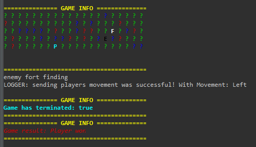
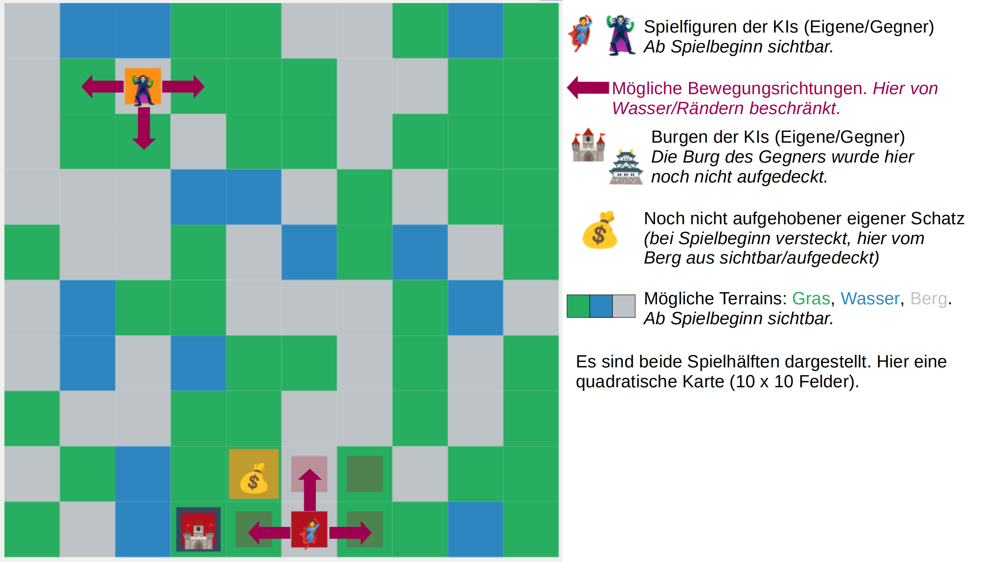
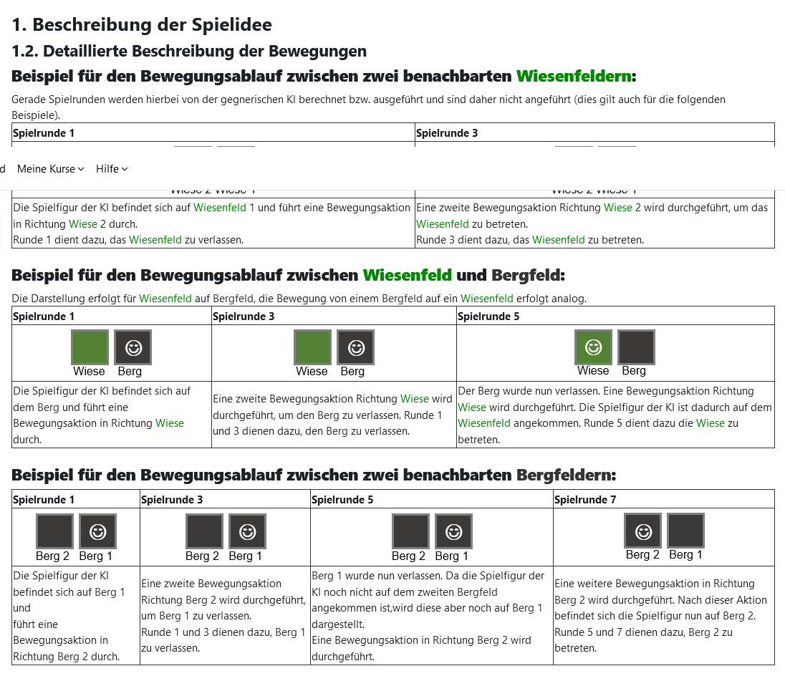

# Treasure Hunt Game with AI as players (client-server architecture)

## Goal of the project:
- **client/player/AI**: On the one hand, the project is intended to demonstrate the implementation of a player (client) AI, whereby this AI automatically interacts with a server: registers, creates and sends a game-map, waits for an opponent and then automatically plays the treasure hunt game with an implemented strategy (*PathfinderAlgorithm module* with *breadth-first search algorithm*).

- **server**: In contrast, there is a server that automatically creates games (gameID), registers players, exchanges game-map halves and initializes a game. (The server here still lacks the additional ability to receive movements and update the map with these movements).
- project: **Java Spring Boot** as **java-gradle**
  - The game idea and the design of the game description comes from an original university project (software engineering winter semester 2021)
  - author: Ing. Dipl.-Ing. Dr.techn. Kristof Böhmer
  - website: https://swe1.wst.univie.ac.at/

## setup procedure for client (player) and server in short

1. **start** server
   - via  gameServer.jar (no movement supported)
2. **start** player 1
   - first get a new **gameID**: either http://localhost:18235/games or uni-server (if up and running) http://swe1.wst.univie.ac.at:18235 (e.g. gameID: `6aDj2`)
   - start **MainClient.java** with Args: `"TR" "http://swe1.wst.univie.ac.at:18235" "6aDj2"`
    or `"TR" "http://localhost:18235" "6aDj2"` (eclipse:Run Configurations:Arguments)
   - or run in cmd via **gamePlayerClient.jar** and enter `java -jar gamePlayerClient.jar TR http://localhost:18235 6aDj2`

3. **start** player 2
   - it is important to start another client, otherwise, player 1 would wait forever

4. server init game and handles player maps, but does not go further (no movement-implementation)

## Example visualization of a 10 x 10 map
> Note: Task can be understood as implementation steps since they were previously a university project.

A possible visualization of the game map, castles, etc., including an explanation of the content shown, can be seen in the graphic below. For subtask 1, the consideration of a command-line interface is absolutely necessary. An additional graphical interface, as used here, is possible but not mandatory. For the first subtask, think about how, what, and where would be visualized.

## Detailed description of the movements

## Description of the game idea
> Note: This description comes from a former university project (software engineering) (author: Ing. Dipl.-Ing. Dr.techn. Kristof Böhmer)

The basic idea of ​​the game is that two clients or their AIs have to complete a comparable task on the same game map without human intervention. The AI ​​that completes these faster wins the game. The AIs are supported by a server that coordinates both clients, enables data exchange, acts as an arbitrator and stores, updates and evaluates data for clients. The rough architecture is therefore specified as a classic client/server architecture.

Initially you have to request a new game from the server. This first step is carried out by a human, everything after that is always fully automated through a client/AI implementation. After starting the client, the AIs register for the game on the server and then create/exchange card halves with the server. The map on which the game is played is not fixed, but is created by combining these randomly generated map halves by the server.

After the card halves have been exchanged, each AI's playing pieces start at a self-selected position (their castle) on the half of the card they created. Each AI then has to explore the map to find their treasure and then the enemy castle as quickly as possible. For this purpose, one treasure is hidden by the server on each of the two halves of the map. An AI's treasure can always be found on the half of the map on which the AI ​​starts. In addition, it can only be picked up and seen by them (no “treasure theft”).

To find the treasure, both AIs move their pawn across the map and gradually reveal card spaces with their pawn. This "revealing" happens when the server evaluates the position of the AIs and updates the game data (e.g. what was seen, recorded, won/lost) appropriately for the clients. The aim is to find your own hidden treasure and then the enemy's castle as quickly as possible. The AI ​​decides for itself, without human intervention, how best to proceed. The more cleverly algorithms, game rules and your own ideas are used during AI development, the faster it will be.

Immediately after the card exchange, all terrain of all map fields, all character positions and your own castle are visible to the AIs or noted on the map that can be queried by the server. Other details such as your own treasure or the opponent's castle are "hidden" and must first be found (revealed/seen). The position of the opponent's figure is random in the first rounds of the game, later it corresponds to the real opponent's position.

>Random vs. Real Opponent Position: For the first 16 rounds of a game, the opponent's position reported by the server must be random. This can also lead to unexpected position information for the opponent (own half, water, etc.). Nevertheless, simply display them in the client UI. Why? This prevents the position of the opponent's castle from being directly revealed via the player position. At the same time, the client code can always assume that information about all players is present. This means that no case distinction is necessary in the client.

As soon as an AI has found or uncovered “its” treasure, it has to move its character to it in order to be able to pick it up. Then, as soon as the treasure has been picked up, the AI ​​has to find the opponent's castle with its character. As soon as this has been found, the AI ​​has to move to it, bribe the guards of the castle with the treasure it has just found and thus "take over" the castle. If the AI ​​has managed to do this, it wins and so does the human player who created this AI.

The server automatically picks up treasure and takes over the castle as soon as a character enters the respective playing field on the map. In the case of treasure, the treasure you have just picked up is also removed directly from the map (it is now in the AI's "inventory" managed by the server).

The game actions themselves are carried out on a turn-based basis. Each AI can only take one action (e.g. a movement command or transferring half of a card) and must then wait until the other AI has taken its action. An AI cannot do without setting an action, but must always carry out an action. However, an AI is not allowed to take an action while it is the other AI's turn. The server supports this, as clients can query whether it is their turn. Punishes (by affected clients losing) but also clients who do not comply with these and other game rules.

In order to make the games exciting for the spectators, it was stipulated that a game may not last longer than 320 game actions (and therefore 320 rounds). The AI ​​has a maximum of 5 seconds to think about each of these turn-based game actions. In total, a game lasts a maximum of 10 minutes. If these conditions are not met, the AI ​​whose turn it is will automatically lose the game and the associated human player will be informed of this by the client. The other human player is informed of his victory by his client. The same automatic procedure is also applied when winning/losing in the normal way. Therefore, if an AI reaches the opponent's castle first with its treasure. The client then always schedules itself independently and no longer sends any actions (card holdings, movements) to the server.

The map played by the AIs is created cooperatively by both artificial intelligences involved at the start of the game. To do this, each of the two AIs randomly creates one half of the final game card (with 5 x 10 fields each). The card halves are randomly assembled by the server on either the short (card dimensions 5 x 20) or the long sides (card dimensions 10 x 10). The AIs cannot influence how this happens and can/must therefore query the server for the status of the entire map. The cards are divided into fields between which the game pieces move step by step horizontally and vertically at the instructions of the AIs. Each field represents exactly one of three possible terrain types: water, meadow or mountain.

Castles and treasures are also placed on one of the fields. However, the castle (from the client) and the treasure (from the server) can only be placed on meadow spaces and not on the same space. In addition, water may not be entered under any circumstances (characters cannot swim). If an AI's pawn moves towards a water space, the AI ​​automatically loses. This also happens if the character would flee the map (e.g. if the character is already on the left edge of the map and still moves further to the left).

Water and meadows can each be entered with a movement action and, in the case of meadows, can also be left again. As soon as a meadow has been entered, it is revealed whether there is a castle or a treasure on this meadow or the latter is picked up directly. In contrast to meadows, mountains require two movement actions to enter them (the mountain space) and two additional actions to leave the mountain again. When entering the mountain field, hidden treasures and enemy castles up to one field away (also diagonally) around the mountain field are revealed by the server for the AI. An AI remains on the original playing field in the visualization and the position data that can be queried by the server until it has sent enough movements to the server to leave the current field and enter the new field.

A new direction of movement can be chosen at any time (e.g. right instead of left). The number of necessary movement commands is then redetermined and counted. Movement commands that have already been sent to the server expire, but the game rounds spent on them still count as spent. For example, if three movement commands were sent in one direction (to move between two mountains) and then a movement command is sent in another direction, the three movement commands that have already been sent expire. Even if a movement command were then sent again in the old previously used direction.

> A playing figure can only move horizontally and vertically to directly adjacent fields; jumping over fields is not possible.

The AIs would have to follow a series of rules while creating the card halves:

Card halves must be randomly generated using algorithms and not statically specified.
- Each half of the map must contain at least 5 mountain spaces, 24 meadow spaces, 7 water spaces and exactly one correctly placed castle.
- It must be possible to enter any other map field from any map field with a series of valid movement commands. This applies to all fields that are not covered with water.
  - No islands may be generated, so mountains and/or meadows may never be completely enclosed by water or map boundaries (or a combination of both).
  - Less than half of each card boundary must consist of water spaces (a maximum of 4 on the long sides and 2 on the short sides) in order not to prevent the change between the two playing card halves.
- These and other conditions/rules mentioned in this document must be adhered to by the client and verified by the server.

If one of the two card halves created by the AIs violates these conditions, the AI ​​that generated the violating card half loses. The other AI automatically wins.

During the game, the map, its known properties and important game states must be visualized by the clients using a command-line interface (CLI). This includes game pieces, positions, castles, fields, terrain, treasures, movements, victory/defeat, card halves, etc. This is so that human players can get excited about the behavior of their artificial intelligences.